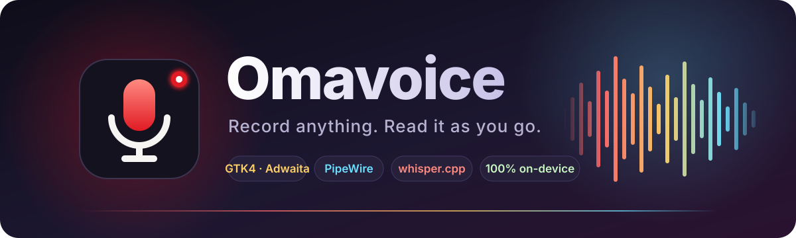
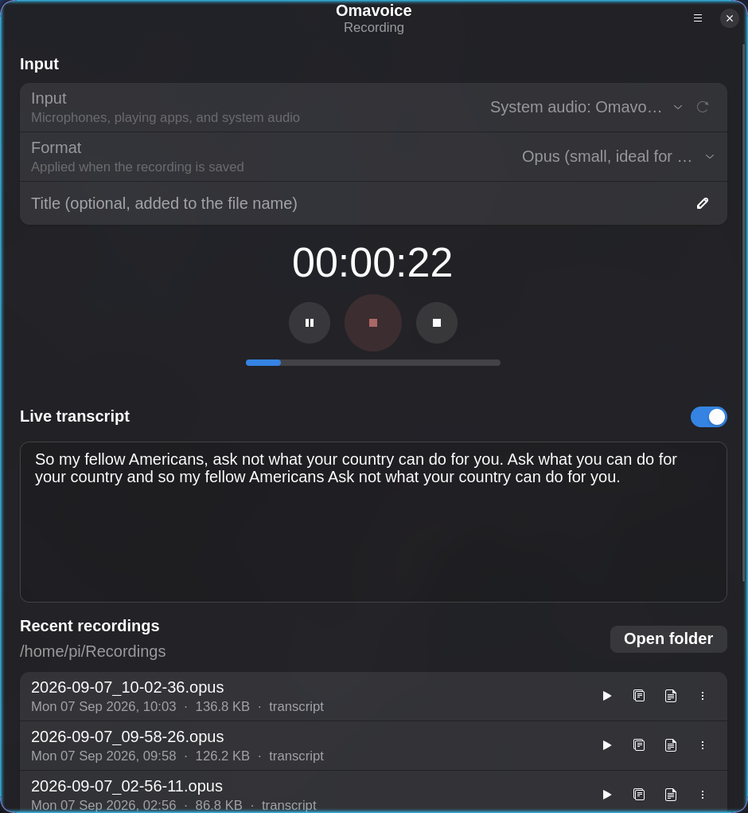
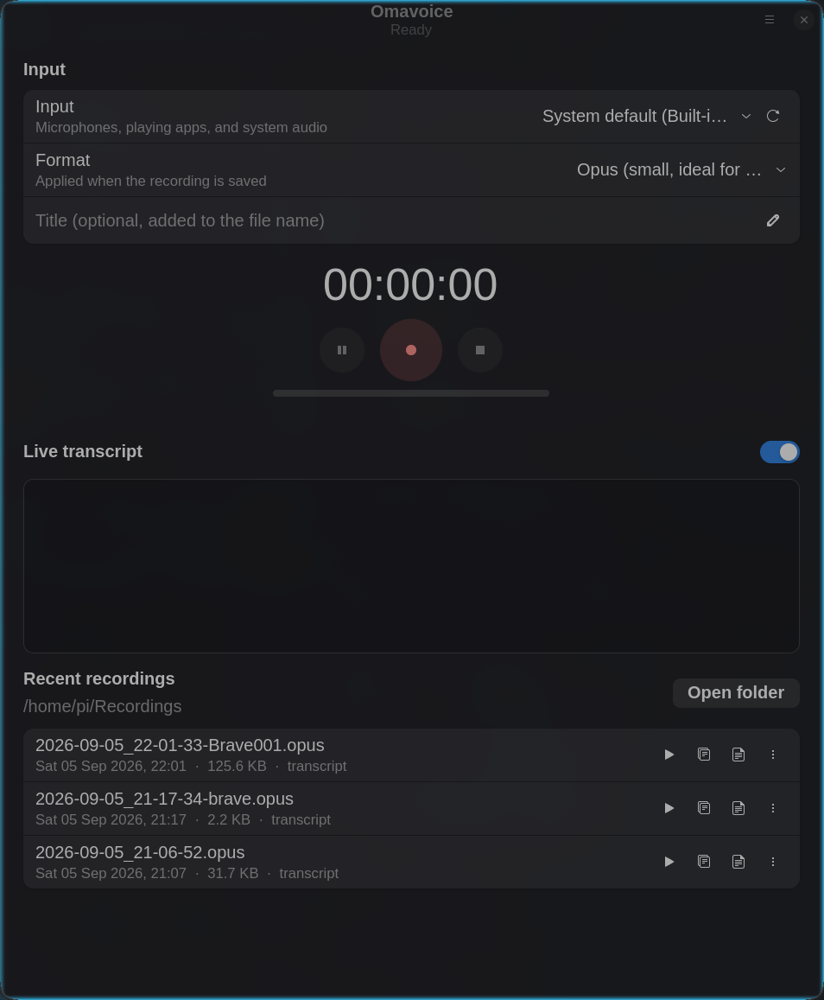
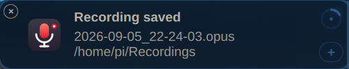
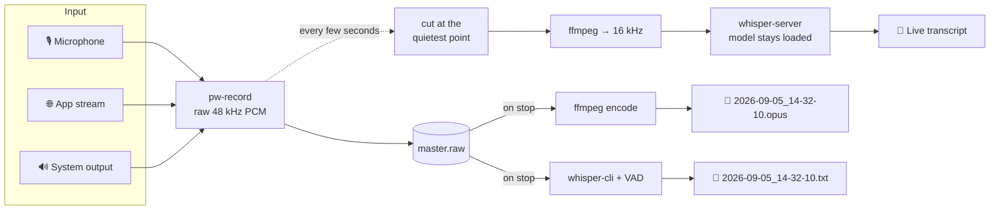

<p align="center">
  
</p>

<p align="center">
  <a href="https://github.com/nixfred/omavoice/releases"></a>
  <a href="LICENSE"></a>
  
  
  
  
</p>

<h3 align="center">A voice recorder for <a href="https://omarchy.org">Omarchy</a> that writes the transcript while you talk.</h3>

<p align="center">
Pick a microphone, a playing app, or the system output. Press the red button.<br>
Watch the words land as you speak. Stop, and there is an audio file in <code>~/Recordings</code><br>
with a <code>.txt</code> of the same name beside it. Nothing ever leaves the machine.
</p>

<br>

<table>
  <tr>
    <td width="50%" align="center"><br><sub><b>Recording.</b> Live captions arrive every few seconds, the meter shows what the input hears.</sub></td>
    <td width="50%" align="center"><br><sub><b>Ready.</b> Input, format, optional title, and the recent takes with play, copy, open, rename, trash.</sub></td>
  </tr>
</table>

<p align="center">
  <br>
  <sub>Every save posts a notification. Click it to open the folder.</sub>
</p>

---

## ✨ What it does

<table>
  <tr>
    <td width="33%" valign="top">
      <h4>🎙️ Any input</h4>
      Microphones, every app that is currently playing audio, and the system output monitor.
      Choose a browser tab's stream and nothing else on the system ends up in the file.
      The list refreshes itself as apps start and stop.
    </td>
    <td width="33%" valign="top">
      <h4>📝 Transcript as you go</h4>
      Live captions from a warm <code>whisper-server</code>, toggleable with one switch.
      Every chunk clears a Silero voice activity check first, so a pause stays a pause
      instead of becoming invented text. When you stop, the whole take is transcribed
      again and the sidecar is replaced with the accurate version.
    </td>
    <td width="33%" valign="top">
      <h4>💾 Five formats</h4>
      Opus, MP3, M4A/AAC, FLAC, WAV. Audio is captured losslessly and encoded on stop,
      so the format never touches the transcript. Opus at 48 kbps is the default and
      a one hour talk is about 20 MB.
    </td>
  </tr>
  <tr>
    <td valign="top">
      <h4>⏯️ Pause, level, silence</h4>
      Pause and resume without stitching. A live level meter, and a banner within
      seconds if the chosen input goes quiet, before you lose a whole take to a muted mic.
    </td>
    <td valign="top">
      <h4>🏷️ Titles and tidy files</h4>
      <code>2026-09-05_14-32-10-Weekly-sync.opus</code> next to
      <code>2026-09-05_14-32-10-Weekly-sync.txt</code>. Rename or trash from the app and
      both files move together.
    </td>
    <td valign="top">
      <h4>⌨️ Hotkey friendly</h4>
      <code>omavoice --toggle</code> starts a take, or stops the one in progress, from any
      keybinding. Media players are paused for mic takes and left alone for app captures.
    </td>
  </tr>
</table>

---

## 🚀 Install

On Arch or Omarchy:

```bash
git clone https://github.com/nixfred/omavoice.git
cd omavoice
makepkg -si
```

Omavoice then shows up in the Omarchy menu: press <kbd>Super</kbd>+<kbd>Space</kbd> and type its name.

Everything it needs is in the official repositories:

| Dependency | Why |
|---|---|
| `python-gobject` `gtk4` `libadwaita` | The window |
| `pipewire-audio` `pulse-native-provider` `libpulse` | Capture and input enumeration |
| `ffmpeg` | Resampling and encoding |
| `whisper-cpp` `ggml-cpu` | Speech recognition, on the CPU, on this machine |

To run straight from a checkout without installing:

```bash
python -m omavoice
```

---

## 🧠 Models

Omavoice looks for whisper.cpp `ggml-*.bin` models in `~/.local/share/omavoice/models`
and, if you use Voxtype, in `~/.local/share/voxtype/models`. With no model present,
open Preferences and download one.

| Model | Size | Use it for |
|---|---|---|
| `base.en` | 142 MB | Live captions on a laptop CPU. The default choice. |
| `small.en` | 466 MB | A stronger final pass. Set it as the final transcript model. |
| `medium.en` | 1.5 GB | Final pass when accuracy matters more than waiting. |
| `silero-v5.1.2` | 1 MB | Voice activity detection. Fetched automatically, and **required** for live captions. |

From the shell:

```bash
scripts/download-model.sh small.en
```

---

## ⌨️ Global hotkey

`omavoice --toggle` starts a recording, or stops the one in progress, in the running
instance. In Omarchy add a binding to `~/.config/hypr/bindings.lua`:

```lua
o.bind("SUPER SHIFT, R", "exec", "omavoice --toggle", "Toggle voice recording")
```

Inside the window <kbd>Ctrl</kbd>+<kbd>R</kbd> does the same, <kbd>Ctrl</kbd>+<kbd>,</kbd> opens Preferences.

---

## ⚙️ How it works



1. **Capture.** `pw-record` streams raw 48 kHz mono PCM into a master file under
   `~/Recordings/.omavoice-tmp/`. Pausing drops incoming blocks, so resume needs no
   stitching, and a crash leaves the raw audio intact. Microphones are targeted by node
   name. A sink monitor or a single application's stream is captured with
   `stream.capture.sink = true`, which is how PipeWire isolates one app's audio. Explicit
   targets carry `node.dont-fallback` and `node.dont-reconnect`, so a stream that vanishes
   ends the take with an error instead of quietly recording something else.
2. **Live captions.** Every few seconds the newest audio is cut at its quietest point
   and resampled by ffmpeg. Before whisper sees it, the chunk is put to the Silero
   voice activity detector, and it is only sent on if there is real speech in it. This
   matters more than it sounds: handed audio with no voice in it, whisper does not
   return nothing, it returns fluent invented text. Loudness alone cannot tell the
   difference, because room tone, music and keystrokes all clear a volume threshold.
   The chunk is sent with **no prompt**. Carrying the previous chunk forward as context
   makes whisper replay that text verbatim over a pause, and makes it delete real words
   at a boundary it mistakes for a repeat. Live captions refuse to start without the
   detector rather than run unguarded.
3. **Finish.** ffmpeg encodes the master into the chosen format, the live text is written
   as a provisional transcript, and `whisper-cli` produces the final transcript in the
   background with Silero voice activity detection. The app holds itself alive until
   that is done, even if you close the window.

Settings live in `~/.config/omavoice/config.json`. The whisper server log is in
`~/.cache/omavoice/whisper-server.log`.

---

## 🧪 Development

```bash
python -m unittest discover -s tests
```

The PKGBUILD runs the test suite during the build. Pure logic (PCM analysis, chunk cut
points, naming, source parsing, config validation, transcript rendering) is covered by
unit tests. The recorder, encoder, and whisper integration are exercised by headless
end-to-end runs against real PipeWire and whisper.cpp.

---

## 🙏 Built on

[whisper.cpp](https://github.com/ggml-org/whisper.cpp) by Georgi Gerganov and contributors.
[PipeWire](https://pipewire.org/) and [WirePlumber](https://pipewire.pages.freedesktop.org/wireplumber/).
[GTK](https://gtk.org/) and [libadwaita](https://gnome.pages.gitlab.gnome.org/libadwaita/).
[Omarchy](https://omarchy.org/) by DHH and the community.

## 📄 License

MIT
